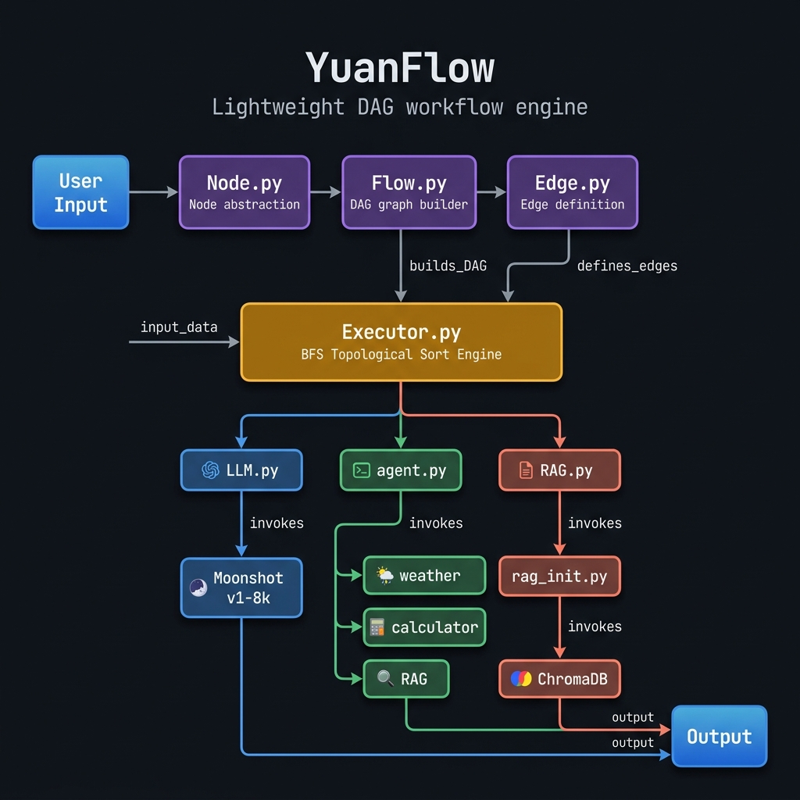
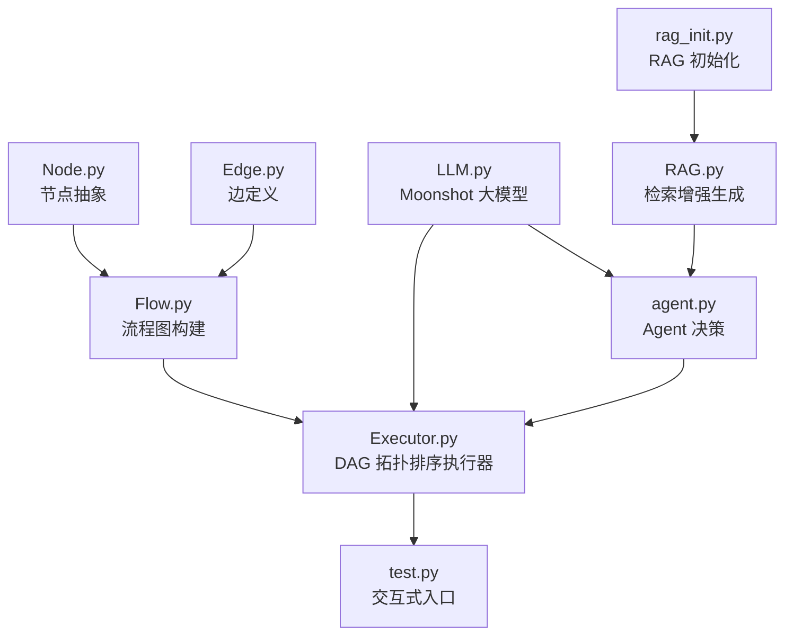
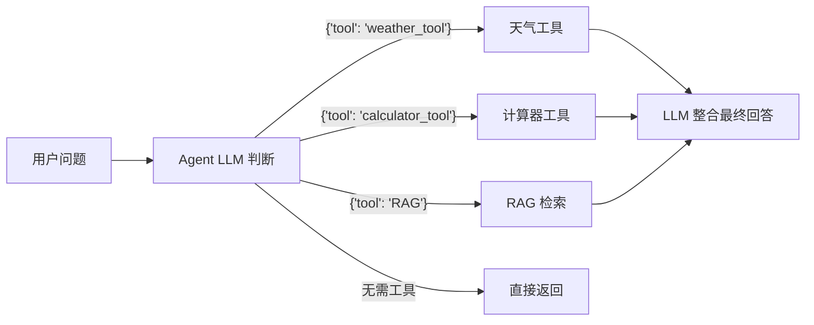

# YuanFlow 项目分析报告

> 本文档由 AI 辅助生成，完整记录了 YuanFlow 项目的架构解析、核心组件详解、Bug 修复历程与改进建议。

---

## 📌 项目概述

**YuanFlow** 是一个轻量级的 **工作流编排引擎**，基于 **DAG（有向无环图）** 拓扑排序实现节点执行，集成了 LLM 调用、RAG 检索和简易 Agent 决策能力。

---

## 🏗️ 架构总览





---

## 📂 文件结构与职责

| 文件 | 职责 |
|------|------|
| `Node.py` | 节点抽象类：封装 `node_id` + `func` |
| `Edge.py` | 边定义：`source` → `target` |
| `Flow.py` | 流程图容器：管理 nodes 和 edges |
| `Executor.py` | **核心引擎**：基于 BFS 拓扑排序执行 DAG，带执行日志与错误处理 |
| `LLM.py` | LLM 节点：调用 Moonshot v1-8k 模型 |
| `RAG.py` | RAG 节点：懒加载 retriever，基于 ChromaDB 检索 + Prompt 组装 |
| `rag_init.py` | RAG 初始化：智能缓存（已有则直接加载）+ 绝对路径 + `rebuild_db()` |
| `agent.py` | Agent 节点：JSON 结构化工具路由 + 工具注册表 + 大小写容错 |
| `test.py` | 交互式入口：支持 Agent / RAG / LLM 三种模式 |
| `data.txt` | 知识库源数据（LangChain 简介） |

---

## 🔑 核心组件详解

### 1. Node — 节点抽象

```python
class Node:
    def __init__(self, node_id, func):
        self.id = node_id
        self.func = func   # 任意可调用函数

    def run(self, input):
        return self.func(input)
```

> 极简设计：每个节点就是一个 **id + 函数** 的包装，天然支持任意 Python 函数作为节点。

---

### 2. Executor — DAG 拓扑排序执行器

这是项目的**核心引擎**，使用经典 BFS 拓扑排序算法：

1. 统计所有节点的**入度**（indegree）
2. 入度为 0 的节点入队，注入初始 `input_data`
3. 逐个出队执行，将输出传递给后继节点
4. 后继节点入度减为 0 时入队
5. 每步打印节点名称与耗时，异常时立即抛出明确错误

---

### 3. Agent — 工具路由



**决策机制**：Prompt 要求 LLM 返回 JSON 格式 `{"tool": "xxx", "input": "xxx"}`；同时兼容旧的 `TOOL: xxx / INPUT: xxx` 文本格式。工具名匹配支持**大小写不敏感**。

**工具注册表**：新增工具只需在 `TOOLS` 字典中添加一项：

```python
TOOLS = {
    "weather_tool":    {"func": weather_tool,    "description": "查询天气信息"},
    "calculator_tool": {"func": calculator_tool, "description": "计算数学表达式"},
    "RAG":             {"func": rag_node,         "description": "从知识库检索信息"},
}
```

---

### 4. RAG 管线


**智能缓存**：`rag_init.py` 在模块加载时检测 `chroma_db/` 是否已存在：
- **存在** → 直接加载，跳过耗时的 embedding 构建
- **不存在** → 构建并持久化

**强制重建**：知识库更新时调用 `rebuild_db()`，自动清除旧库后重建。

---

## 🔧 技术栈

| 层面 | 技术 |
|------|------|
| LLM | **Moonshot v1-8k**（通过 OpenAI 兼容接口） |
| Embedding | **DashScope text-embedding-v2**（通义千问） |
| 向量数据库 | **ChromaDB**（本地持久化） |
| 框架 | **LangChain**（document loaders, splitters, embeddings, vectorstores） |
| 计算工具 | **numexpr** |
| 环境管理 | **python-dotenv** |

---

## ▶️ 执行流程（test.py）

`test.py` 提供三种预设流：

| 模式 | DAG 路径 | 适用场景 |
|------|---------|---------|
| Agent 模式 | `prompt → agent → output` | 通用问答，自动路由工具 |
| RAG 模式 | `prompt → rag → llm → output` | 知识库专项检索 |
| LLM 模式 | `prompt → llm → output` | 纯大模型对话 |

**以 Agent 模式输入 `"查询今天天气"` 为例：**

```
Step 1: prompt  → "查询今天天气"（原样传递）
Step 2: agent   → LLM 判断 → {"tool": "weather_tool", "input": "今天天气"}
                → weather_tool() → "今天是晴天 25摄氏度"
                → LLM 整合 → "今天天气晴朗，气温 25°C，适合外出。"
Step 3: output  → 打印最终结果
```

---

## 🐛 Bug 修复记录

| # | 严重性 | 位置 | 问题 | 修复方案 |
|---|--------|------|------|---------|
| 1 | 🔴 高危 | `agent.py` | 工具执行异常后 `result` 未定义，导致 `UnboundLocalError` | try 块前初始化 `result = ""` |
| 2 | 🔴 高危 | `agent.py` | LLM 返回工具名大小写不可控，精确匹配失败 | 新增 `_fuzzy_match_tool()` 大小写不敏感匹配 |
| 3 | 🟡 中危 | `Executor.py` | 空 Flow 静默返回 `None`，无任何提示 | `step == 0` 时抛出明确 `RuntimeError` |
| 4 | 🟡 中危 | `rag_init.py` | 相对路径在不同 `cwd` 下错误 | 改用 `os.path.abspath(__file__)` 绝对路径 |
| 5 | 🟡 中危 | `RAG.py` | `rebuild_db()` 后 `retriever` 仍绑定旧 `db` 实例 | 改为懒加载 `_get_retriever()` |
| 6 | 🟢 低危 | `test.py` | 冗余 import 导致重复初始化 | 整理 import 顺序 |

---

## 🔮 后续改进方向

| # | 方向 | 说明 |
|---|------|------|
| 1 | **Executor 多输入合并** | 增加 `merge` 节点，支持多个上游节点输出汇聚为一个输入 |
| 2 | **真实天气工具** | 接入高德/和风天气 API，替换硬编码返回值 |
| 3 | **并行执行** | 对无依赖关系的节点使用 `asyncio` 并行执行，降低延迟 |
| 4 | **LLM 重试机制** | 调用失败时自动重试（指数退避），提升稳定性 |
| 5 | **Flow 可视化** | 将 DAG 结构导出为 Mermaid / Graphviz 图 |
